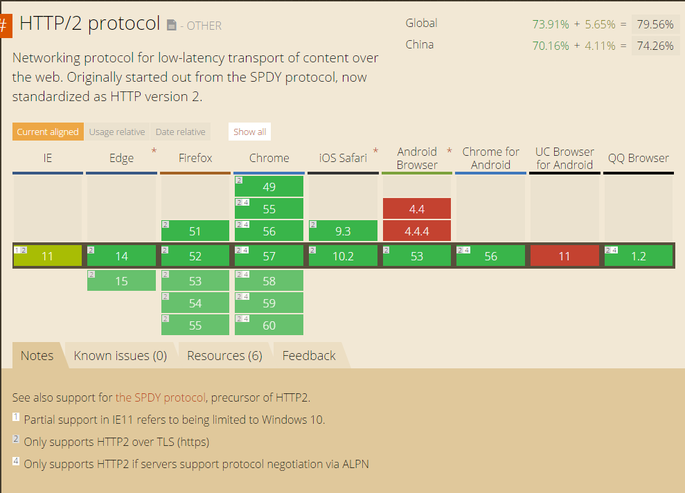
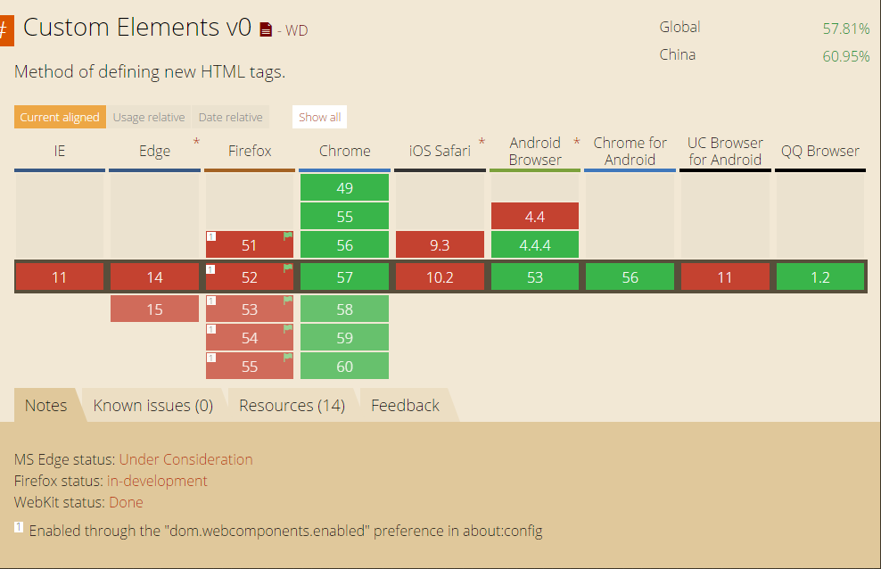
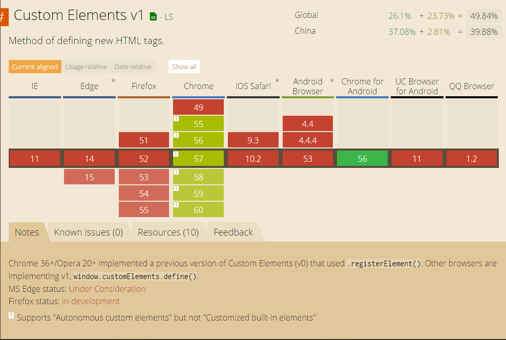
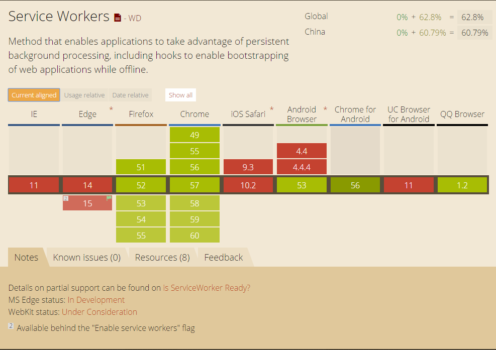
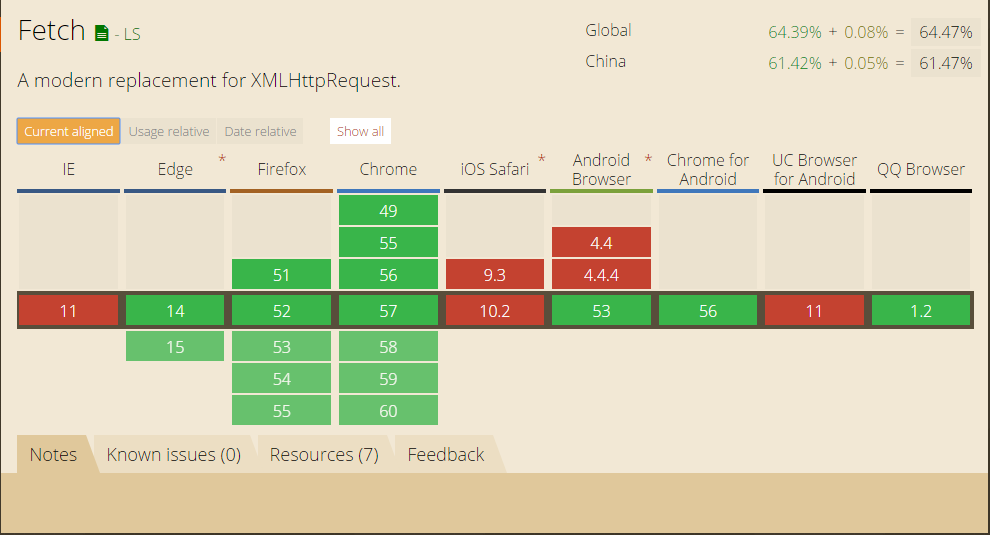
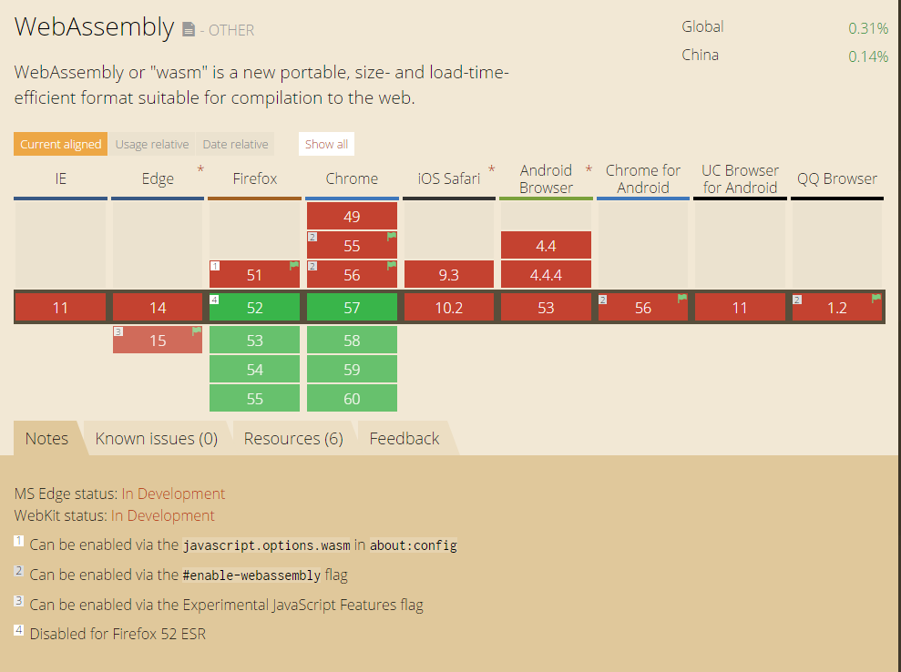

# Web Sockets
| IE | Chrome | iOS Safari | Android |
|---|---|---|---|
| 10+ | 16+ | 6.1+ | 4.4+ |

# HTTP/2
| IE | Chrome | iOS Safari | Android |
|---|---|---|---|
| 11+ | 41+ | 9.2+ | Chromium |

# Custom Element
| IE | Chrome | iOS Safari | Android |
|---|---|---|---|
| x | 33+ | x | 4.4.4+ |

| IE | Chrome | iOS Safari | Android |
|---|---|---|---|
| x | 55+ | x | x |

# Service Workers
| IE | Chrome | iOS Safari | Android |
|---|---|---|---|
| x | 40+ | x | Chromium |

# Fetch
| IE | Chrome | iOS Safari | Android |
|---|---|---|---|
| x | 42+ | x | Chromium |

# WebAssembly
| IE | Chrome | iOS Safari | Android |
|---|---|---|---|
| x | 57+ | x | x |

